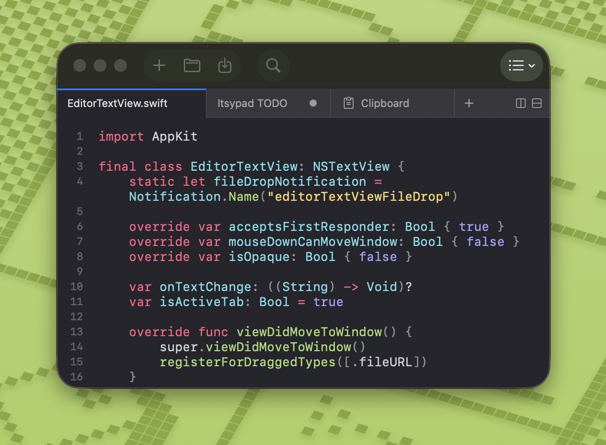

# Itsypad

[](https://github.com/nickustinov/itsypad-macos/actions/workflows/tests.yml)

A tiny, fast scratchpad and clipboard manager for Mac. Free forever. [itsypad.app](https://itsypad.app)



## Features

- **Text editor** — syntax highlighting, multi-tab, split view, find and replace, clickable links, lists and checklists
- **Clipboard manager** — 1,000-item history, searchable, keyboard navigable, grid or panels layout, iCloud sync (text entries)
- **Global hotkeys** — tap left ⌥ three times to show/hide, or define your own hotkey
- **Lightweight** — nearly zero CPU and memory usage
- **No AI, no telemetry** — your data stays on your machine
- **Menu bar icon** — show or hide in menu bar
- **Dock icon** — show or hide in Dock, as you prefer
- **Open at login** — optional auto-start
- **iCloud sync** — sync scratch tabs and clipboard history (text only) across Macs via iCloud
- **12 languages** — English, Spanish, French, German, Russian, Japanese, Simplified Chinese, Traditional Chinese, Korean, Portuguese (Brazil), Italian, Polish

## Editor
- **Multi-tab and split view** — work on multiple files/notes at once, drag to reorder, pin tabs to keep them visible (tab bar by [Bonsplit](https://github.com/almonk/bonsplit))
- **Syntax highlighting** — 185+ languages via [highlight.js](https://highlightjs.org), with automatic language detection
- **Find and replace** — built-in find bar with next/previous match and use selection for find
- **Session persistence** — all tabs, content, and cursor positions are preserved across restarts
- **Auto-save** — content is continuously saved to session, never lose your work
- **Markdown preview** — side-by-side rendered preview for `.md` tabs (⇧⌘P), live-updates as you type, themed code blocks, local images
- **Clickable links** — URLs in plain text and markdown tabs are highlighted and underlined; click to open in browser
- **Always on top** — pin the window above all other apps (⇧⌘T)
- **Syntax themes** — 9 curated themes (Atom One, Catppuccin, GitHub, Gruvbox, IntelliJ / Darcula, Itsypad, Stack Overflow, Tokyo Night, Visual Studio) with dark and light variants

## Lists and checklists

Itsypad supports markdown-compatible lists and checklists directly in the editor. All state lives in the text itself — no hidden metadata, fully portable.

### Syntax

```
- bullet item
* also a bullet
1. numbered item
- [ ] unchecked task
- [x] completed task
```

### How it works

Type a list prefix and start writing. Press **Enter** to auto-continue with the next item. Press **Enter** on an empty item to exit list mode. Use **Tab** / **Shift+Tab** to indent and outdent list items.

For checklists, press **⇧⌘L** to convert any line(s) to a checklist, or type `- [ ] ` manually. Toggle checkboxes with **⌘Return** or by clicking directly on the `[ ]` / `[x]` brackets. Checked items appear with ~~strikethrough~~ and dimmed text.

Move lines up or down with **⌥⌘↑** / **⌥⌘↓**. Wrapped list lines align to the content start, not the bullet.

### Visual styling

| Element | Appearance |
|---|---|
| Bullet dashes `-`, `*` | 🔴 Magenta/red (`bulletDashColor`) |
| Ordered numbers `1.` | 🔴 Magenta/red (`bulletDashColor`) |
| Checkbox brackets `[ ]`, `[x]` | 🟣 Purple |
| Checked item content | ~~Strikethrough~~ + dimmed |
| URLs `https://...` | 🔵 Blue underlined (`linkColor`) |

## Clipboard manager
- **Text and images** — stores up to 1,000 clipboard entries
- **Searchable** — filter history with highlighted search matches
- **Click to copy** — click any entry to copy it back to clipboard (or paste directly — configurable in settings)
- **Quick-access shortcuts** — ⌘1–9 to copy the Nth item, ⌥1–9 to paste it into the previously active app
- **Zoom preview** — hover a tile and click the magnifying glass to view full content in a near-fullscreen overlay
- **Keyboard navigation** — arrow keys to browse items, Enter to copy, Space to preview/unpreview, Escape to deselect
- **Grid or panels** — switch between a multi-column grid and full-width panel rows
- **Configurable cards** — adjust preview line count and font size in settings
- **Delete entries** — remove individual items on hover
- **Separate hotkey** — assign a dedicated global hotkey to show/hide
- **iCloud sync** — text entries sync across devices alongside scratch tabs (up to 200 most recent)

## Install

```bash
brew install --cask nickustinov/tap/itsypad
```

Or download the latest DMG from [GitHub releases](https://github.com/nickustinov/itsypad-macos/releases).

## Keyboard shortcuts

| Shortcut | Action |
|----------|--------|
| ⌘T / ⌘N | New tab |
| ⌘W | Close tab |
| ⌘O | Open file |
| ⌘S | Save |
| ⇧⌘S | Save as |
| ⌃Tab | Next tab |
| ⇧⌃Tab | Previous tab |
| ⌘F | Find |
| ⌥⌘F | Find and replace |
| ⌘G | Find next |
| ⇧⌘G | Find previous |
| ⌘E | Use selection for find |
| ⌘D | Duplicate line |
| ⌘Return | Toggle checkbox |
| ⇧⌘L | Toggle checklist |
| ⌥⌘↑ | Move line up |
| ⌥⌘↓ | Move line down |
| ⌘1–9 | Switch to tab by position |
| ⇧⌘T | Always on top |
| ⇧⌘D | Split right |
| ⇧⌃⌘D | Split down |
| ⌘+ | Increase font size |
| ⌘- | Decrease font size |
| ⌘0 | Reset font size |
| Tab | Indent line/selection |
| ⇧Tab | Unindent line/selection |
| Fn↓ / Fn↑ | Page down / up (moves cursor) |

### Clipboard

| Shortcut | Action |
|----------|--------|
| ↓ | Move focus from search to first item |
| ↑↓←→ | Navigate between items |
| Return | Copy selected item (or paste — see settings) |
| Space | Toggle preview overlay |
| Escape | Deselect item / close preview |
| ⌘1–9 | Copy Nth visible item to clipboard |
| ⌥1–9 | Copy Nth item and paste into active app |

## Also by me

If you like Itsypad, check out my other macOS apps - same philosophy of native, lightweight, no-bloat design.

**[Itsyhome](https://itsyhome.app)** - Control your entire smart home from the macOS menu bar. Cameras, lights, thermostats, locks, scenes, and 18+ HomeKit device types. Global keyboard shortcuts, Stream Deck support, deeplinks, and webhooks for power users. Free and [open source](https://github.com/nickustinov/itsyhome-macos).

**[Itsytv](https://itsytv.app)** - The missing Apple TV remote for macOS. Full D-pad and playback controls, now-playing widget, app launcher, text input, and multi-device support. Free and [open source](https://github.com/nickustinov/itsytv-macos).

## Distribution

Itsypad ships in two variants from the same codebase: a **direct/DMG** version (downloaded from GitHub/Homebrew) and an **App Store** version. The differences are minimal but important to understand.

### Schemes and configs

| Scheme | Configs | Entitlements | Use |
|---|---|---|---|
| `itsypad` | `Debug` / `Release` | `itsypad-direct.entitlements` | Direct/DMG distribution |
| `itsypad-appstore` | `Debug-AppStore` / `Release-AppStore` | `itsypad.entitlements` | App Store distribution |

App Store configs set the `APPSTORE` Swift compilation condition, used to hide features that aren't allowed in the App Store (e.g. the update checker).

### Entitlements

Both entitlements files are sandboxed and share the same capabilities:

| Entitlement | Direct | App Store |
|---|---|---|
| `app-sandbox` | yes | yes |
| `files.user-selected.read-write` | yes | yes |
| `files.bookmarks.app-scope` | yes | yes |
| `cs.allow-unsigned-executable-memory` | yes (highlight.js JSContext) | yes |
| `network.client` | yes (update checker) | no |
| `ubiquity-kvstore-identifier` | yes (legacy, unused) | yes (legacy, unused) |
| `icloud-container-identifiers` | `iCloud.com.nickustinov.itsypad` | same |
| `icloud-container-environment` | `Production` | same |
| `icloud-services` | `CloudKit` | same |

The only real difference is `network.client` – the direct version needs it for checking GitHub releases. The App Store version doesn't need it because App Store handles updates.

Both versions use the same CloudKit container (`iCloud.com.nickustinov.itsypad`) and sync with each other.

### Signing

- **Direct/DMG:** Signed with "Developer ID Application" certificate and a Developer ID provisioning profile. The build script (`scripts/build-release.sh`) archives unsigned, embeds the profile, then manually signs with resolved entitlements (Xcode variables like `$(TeamIdentifierPrefix)` are expanded to literal values).
- **App Store:** Signed automatically by Xcode with the App Store provisioning profile. Uploaded via Xcode Organizer or `xcodebuild -exportArchive`.

### iCloud sync

Both versions use CloudKit via `CKSyncEngine` for syncing scratch tabs and clipboard history. The `CloudSyncEngine` singleton manages the sync lifecycle. See the record schema and sync flow in the [iOS migration docs](../itsypad-ios/docs/cloudkit-sync.md).

## Architecture

```
Sources/
├── App/
│   ├── AppDelegate.swift                # Menu bar, toolbar, window, and panel setup
│   ├── BonsplitRootView.swift           # SwiftUI root view rendering editor and clipboard tabs
│   ├── CloudSyncEngine.swift            # CloudKit sync via CKSyncEngine for tabs and clipboard
│   ├── G2SyncEngine.swift              # Even Realities G2 glasses sync (Labs)
│   ├── KVSMigration.swift              # Legacy iCloud KVS data migration
│   ├── Launch.swift                     # App entry point
│   ├── MenuBuilder.swift                # Main menu bar construction
│   ├── Models.swift                     # ShortcutKeys and shared data types
│   ├── TabStore.swift                   # Tab data model with persistence
│   └── UpdateChecker.swift              # GitHub release check for new versions
├── Editor/
│   ├── EditorContentView.swift          # NSViewRepresentable wrapping text view, scroll view, and gutter
│   ├── EditorCoordinator.swift          # Tab/pane orchestrator bridging TabStore and Bonsplit
│   ├── EditorStateFactory.swift         # Editor state creation and theme application
│   ├── EditorTextView.swift             # NSTextView subclass with editing helpers and file drops
│   ├── EditorTheme.swift                # Dark/light color palettes with CSS-derived theme cache
│   ├── FileWatcher.swift                # DispatchSource-based file change monitoring
│   ├── HighlightJS.swift                # JSContext wrapper for highlight.js with CSS/HTML parsing
│   ├── LanguageDetector.swift           # File extension → language mapping for highlight.js
│   ├── LayoutSerializer.swift           # Split layout capture and restore for session persistence
│   ├── LineNumberGutterView.swift       # Line number gutter drawn alongside the text view
│   ├── ListHelper.swift                 # List/checklist parsing, continuation, and toggling
│   ├── MarkdownPreviewManager.swift     # Markdown preview lifecycle and toolbar integration
│   ├── MarkdownPreviewView.swift        # WKWebView wrapper for rendered markdown preview
│   ├── MarkdownRenderer.swift           # Markdown-to-HTML via marked.js + highlight.js in JSContext
│   ├── SessionRestorer.swift            # Session restore logic for tabs and editor state
│   ├── SyntaxHighlightCoordinator.swift # Syntax highlighting coordinator using HighlightJS
│   └── SyntaxThemeRegistry.swift        # Curated syntax theme definitions with dark/light CSS mapping
├── Clipboard/
│   ├── ClipboardStore.swift             # Clipboard monitoring, history persistence, and CloudKit sync
│   ├── ClipboardContentView.swift       # NSCollectionView grid with search, keyboard nav, and layout
│   ├── ClipboardCollectionView.swift    # NSCollectionView subclass with key event delegation
│   ├── ClipboardCardItem.swift          # NSCollectionViewItem wrapper for card views
│   ├── ClipboardCardView.swift          # Individual clipboard card with preview, delete, and zoom
│   ├── ClipboardPreviewOverlay.swift    # Near-fullscreen zoom preview overlay
│   ├── ClipboardTabView.swift           # NSViewRepresentable wrapper for ClipboardContentView
│   ├── CardTextField.swift              # Non-interactive text field (suppresses I-beam cursor)
│   └── AccessibilityHelper.swift        # Accessibility check and CGEvent paste simulation
├── Settings/
│   ├── SettingsStore.swift              # UserDefaults-backed settings with change notifications
│   ├── SettingsView.swift               # SwiftUI settings window (general, editor, appearance, clipboard)
│   └── ShortcutRecorder.swift           # SwiftUI hotkey recorder control
├── Hotkey/
│   ├── HotkeyManager.swift              # Global hotkeys and triple-tap modifier detection
│   └── ModifierKeyDetection.swift       # Left/right modifier key identification from key codes
├── Resources/
│   ├── Assets.xcassets                  # App icon and custom images
│   └── Localizable.xcstrings           # String catalog for 12 languages
├── Info.plist                           # Bundle metadata and document types
├── itsypad.entitlements                 # App Store entitlements (sandbox, CloudKit, iCloud)
└── itsypad-direct.entitlements          # Direct/DMG entitlements (adds network.client for update checker)
Executable/
└── main.swift                           # Executable target entry point
Packages/
└── Bonsplit/                            # Local package: split pane and tab bar framework
Tests/
├── AutoDetectTests.swift
├── ClipboardShortcutTests.swift
├── ClipboardStoreTests.swift
├── CloudSyncEngineTests.swift
├── EditorThemeTests.swift
├── FileWatcherTests.swift
├── HighlightJSTests.swift
├── KVSMigrationTests.swift
├── LanguageDetectorTests.swift
├── LineNumberGutterViewTests.swift
├── ListHelperTests.swift
├── MarkdownPreviewManagerTests.swift
├── MarkdownRendererTests.swift
├── ModifierKeyDetectionTests.swift
├── SettingsStoreTests.swift
├── ShortcutKeysTests.swift
├── SyntaxThemeRegistryTests.swift
└── TabStoreTests.swift
scripts/
├── build-release.sh                    # Build, sign, and package DMG for direct distribution
├── pull-translations                   # Pull translations from Lokalise into xcstrings
└── push-translations                   # Push English source strings to Lokalise
```

## Requirements

- macOS 14 (Sonoma) or later
- Xcode 16.0 or later
- [XcodeGen](https://github.com/yonaskolb/XcodeGen) for Xcode project generation

## Building

```bash
xcodegen generate
open itsypad.xcodeproj
```

Then build and run with ⌘R in Xcode. Tests run with ⌘U.

## Releasing

### Both versions

1. Bump `MARKETING_VERSION` and `CURRENT_PROJECT_VERSION` in `project.yml`
2. Run `xcodegen generate`

### Direct/DMG release

3. Build, sign, and package:

```bash
bash scripts/build-release.sh
```

This archives with the `itsypad` scheme (`Release` config), embeds the Developer ID provisioning profile, signs with `itsypad-direct.entitlements`, and creates a DMG.

4. Notarize and staple:

```bash
xcrun notarytool submit dist/itsypad-<VERSION>.dmg \
    --apple-id <APPLE_ID> --team-id <TEAM_ID> \
    --password <APP_SPECIFIC_PASSWORD> --wait
xcrun stapler staple dist/itsypad-<VERSION>.dmg
```

5. Create the GitHub release:

```bash
gh release create v<VERSION> dist/itsypad-<VERSION>.dmg \
    --title "v<VERSION>" --notes "Release notes here"
git fetch --tags
```

6. Update the Homebrew tap:

```bash
shasum -a 256 dist/itsypad-<VERSION>.dmg
# Update Casks/itsypad.rb in homebrew-tap with new version and sha256
```

### App Store release

3. Archive with the `itsypad-appstore` scheme (`Release-AppStore` config) in Xcode
4. Upload to App Store Connect via Xcode Organizer
5. Submit for review in App Store Connect

## Localization

Itsypad uses a Swift String Catalog (`Sources/Resources/Localizable.xcstrings`) for localization. Translations are managed via [Lokalise](https://lokalise.com).

Languages: English (base), Spanish, French, German, Russian, Japanese, Simplified Chinese, Traditional Chinese, Korean, Portuguese (Brazil), Italian, Polish.

### Setup

```bash
brew tap lokalise/cli-2
brew install lokalise2
cp lokalise.yml.example lokalise.yml
# Edit lokalise.yml and add your API token
```

### Push source strings to Lokalise

Extracts English keys and values from the xcstrings file and uploads to Lokalise:

```bash
scripts/push-translations
```

### Pull translations from Lokalise

Downloads all translations from Lokalise and merges them into the xcstrings file:

```bash
scripts/pull-translations
```

### How it works

- SwiftUI literals (`Text("...")`, `Toggle("...", ...)`, etc.) auto-extract into the string catalog at build time
- AppKit strings (`NSMenuItem`, `NSAlert`, `NSToolbarItem`, etc.) are wrapped with `String(localized:defaultValue:)`
- All strings use structured keys (e.g. `menu.file.new_tab`) with English default values
- Xcode populates the `.xcstrings` file with discovered keys when you build the project
- Push extracts English as `.strings` and uploads to Lokalise
- Pull downloads `.strings` per language and merges back into the xcstrings file

## License

MIT — see [LICENSE](LICENSE).
